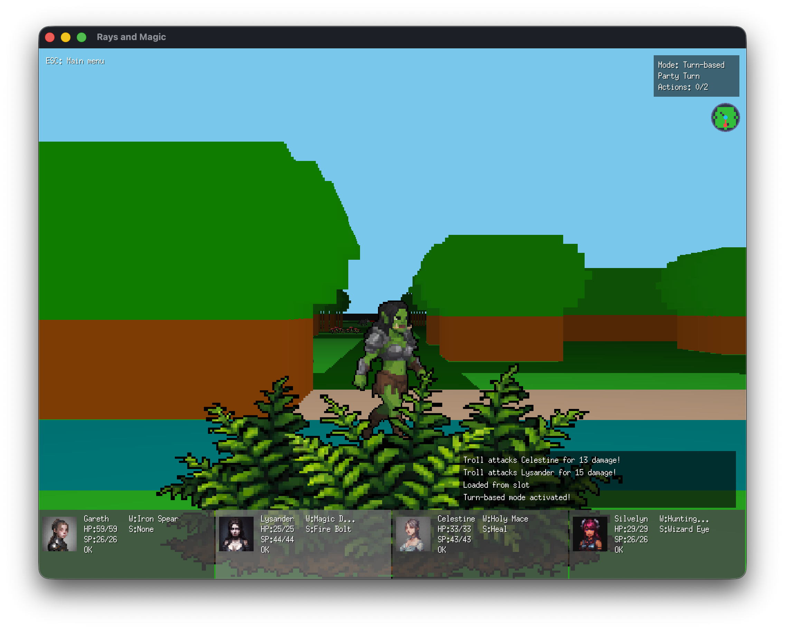
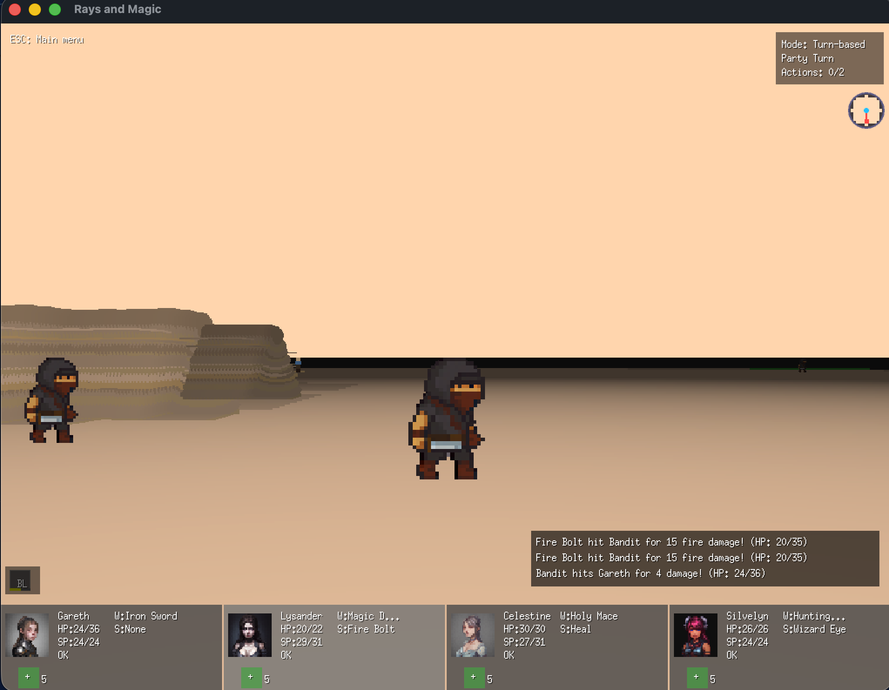
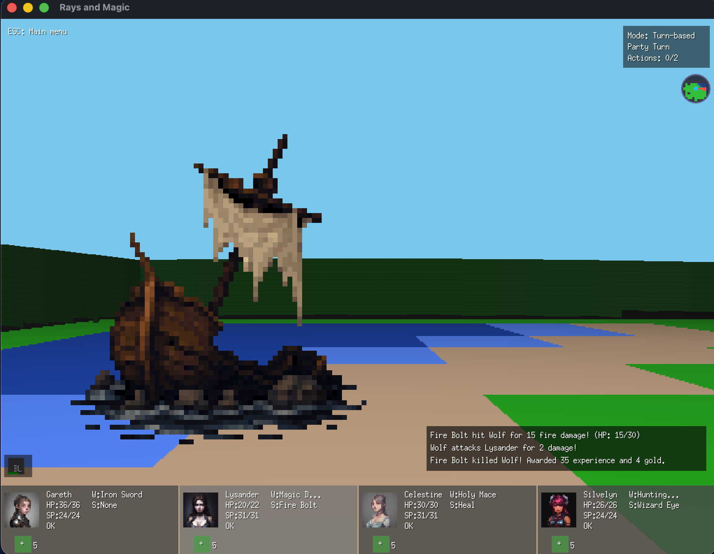

# RaysAndMagic

A retro first-person party RPG built with Go and Ebiten. Lead a four-member party through raycasted dungeons, fight in real-time or turn-based combat, and slay the four dragons to save the realm.





## Features

- First-person raycasting engine with sprite-based monsters and NPCs
- 4-member party with distinct classes (Knight, Sorcerer, Cleric, Archer)
- Hybrid combat: switch between real-time and turn-based modes
- YAML-driven content: items, weapons, spells, monsters, quests, and maps
- NPC interactions: merchants, spell traders, and encounter triggers
- Victory system with score tracking and local high scores

## Quick Start

**Requirements:** Go 1.23+, Ebiten v2

```bash
go mod tidy
go run .
```

**Build:**

```bash
go build -o bin/raysandmagic .
```

## Controls

| Key           | Action                             |
| ------------- | ---------------------------------- |
| WASD / Arrows | Move and turn                      |
| Q / E         | Strafe                             |
| Space         | Melee attack / confirm action      |
| F             | Cast equipped spell                |
| H + click     | Targeted heal                      |
| 1-4           | Select party member                |
| Tab           | Toggle real-time / turn-based      |
| I / C / M     | Inventory / Characters / Spellbook |
| T             | Talk to nearby NPC                 |
| ESC           | Menu / close dialogs               |

## Project Structure

```text
├── main.go              # Entry point
├── assets/              # Game data (YAML configs, maps, sprites)
│   ├── *.yaml           # Items, weapons, spells, monsters, quests, NPCs
│   ├── *.map            # ASCII map files
│   └── sprites/         # Character and monster sprites
└── internal/            # Game packages
    ├── game/            # Core game loop, combat, UI, rendering
    ├── character/       # Party, classes, stats, equipment
    ├── monster/         # Monster AI and configuration
    ├── items/           # Item system
    ├── spells/          # Spell casting system
    ├── quests/          # Quest tracking
    ├── world/           # Map loading and tile system
    └── config/          # YAML loaders
```

## Content Files

| File               | Purpose                                |
| ------------------ | -------------------------------------- |
| `items.yaml`       | Armor, accessories, consumables        |
| `weapons.yaml`     | Melee and ranged weapons               |
| `spells.yaml`      | Magic spells with damage/healing       |
| `monsters.yaml`    | Monster stats, AI, and map letters     |
| `quests.yaml`      | Quest definitions and rewards          |
| `npcs.yaml`        | NPCs (merchants, trainers, encounters) |
| `loots.yaml`       | Monster drop tables                    |
| `tiles.yaml`       | Tile types per biome                   |
| `map_configs.yaml` | Per-map settings (biome, sky color)    |

## Map Format

Maps are ASCII files where each character represents a tile or entity:

- `.` Floor / `#` Wall / `+` Player start
- `T` Tree (biome-dependent) / `W` Water / `D` Door
- Lowercase letters spawn monsters (e.g., `w` = wolf, `d` = dragon)
- `@` marks NPC/special tile positions, defined at line end with `>[npc:key]`

## Development

```bash
go fmt ./... && go vet ./...   # Format and lint
go test ./...                   # Run tests
```
