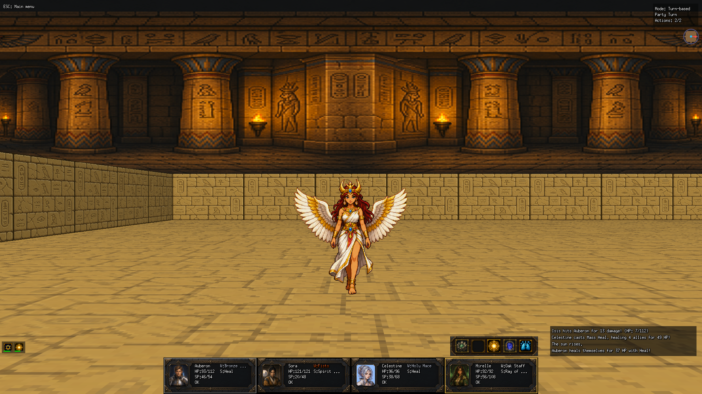
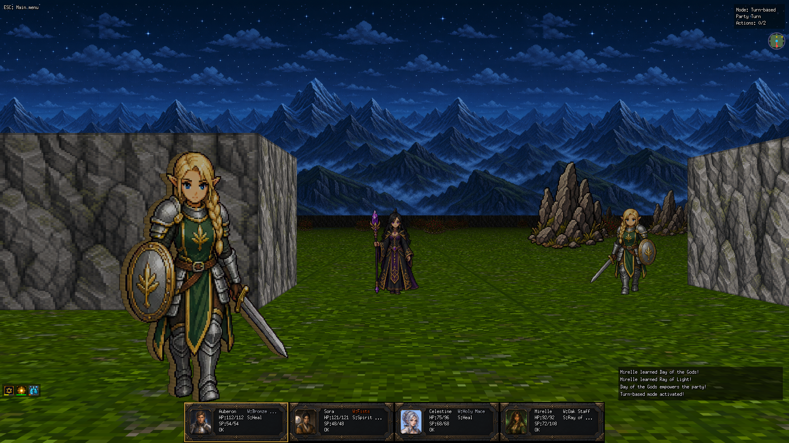
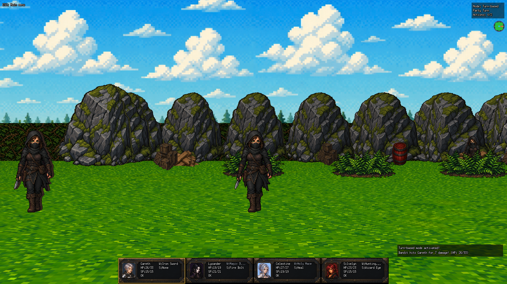
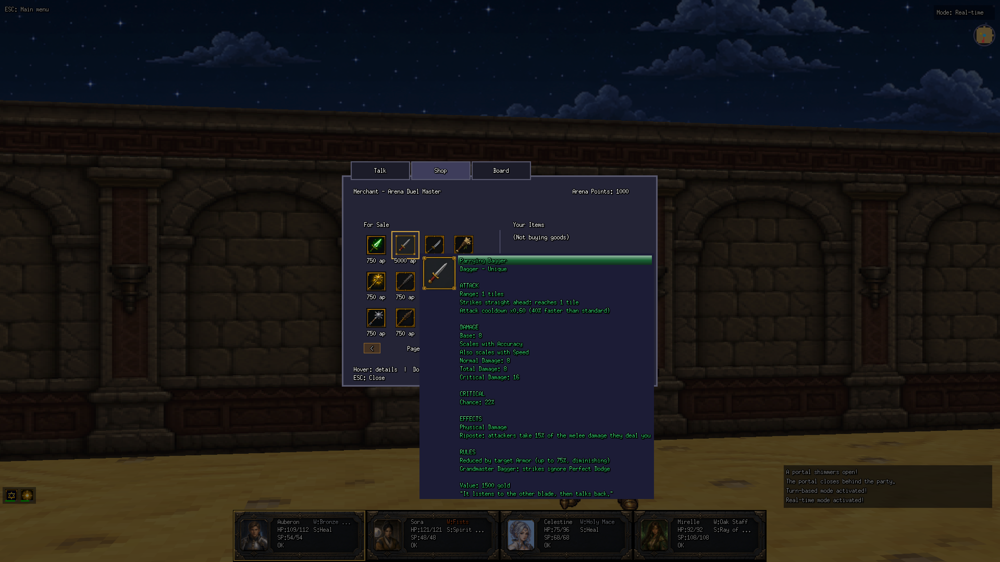
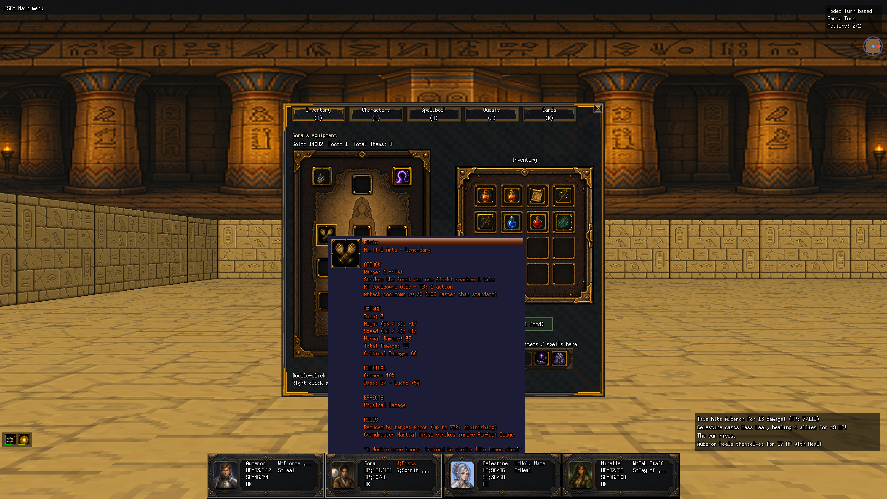
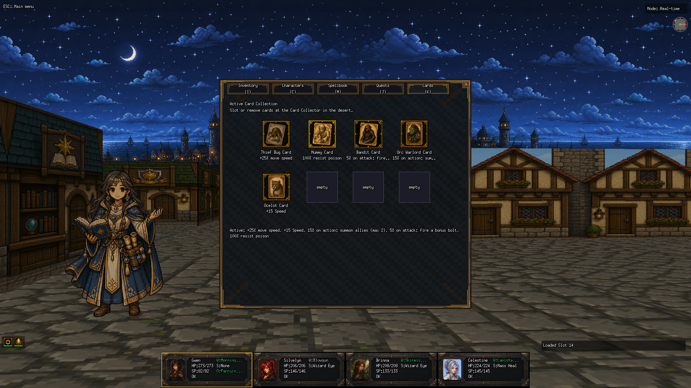

# RaysAndMagic

A retro first-person party RPG built with Go and [Ebiten](https://ebitengine.org/). Lead a four-member party through raycasted dungeons and open wilds, fight in real-time *or* turn-based combat, learn spells from nine schools of magic, and hunt the four dragons that menace the realm.



## Screenshots

| | |
| --- | --- |
|  |  |
| *Day/night cycle - the world darkens, the fights don't stop* | *Bandit ambush in the wilds - roadside props and all* |
|  |  |
| *Arena quartermaster - spend arena points on unique gear* | *Unique classes - a Monk's bare hands outhit steel* |
|  | |
| *Build customization with rare monster cards* | |

## Features

- **Explore a hand-built realm** - the seaside city of Seabright, forests and deserts, ancient pyramids, the ocean depths, a lich's nexus, windswept dragon cliffs, and the sewers beneath it all
- **Build your party** from six classes: Knight, Paladin, Archer, Cleric, Sorcerer, and Druid
- **Fight your way** - switch between real-time and turn-based combat whenever the moment calls for it
- **Master nine schools of magic** spanning the elements, mind and body, and light and dark - then choose your damage to exploit what each foe can't withstand
- **Loot and outfit your party** with weapons, armor, and consumables, each with the full stats laid bare before you commit
- **Take on quests** from the realm's townsfolk and traders, and the bosses that lurk in the depths
- **Retro raycast visuals** - sprite enemies, scrolling skies, biome textures, and spell-effect particles

## Quick Start

**Requirements:** Go 1.25+, Ebiten v2.9

```bash
go mod tidy
go run .
```

**Build local binaries:**

```bash
mkdir -p bin
go build -o bin/raysandmagic .
go build -o bin/map_viewer ./assets/map_viewer
```

The game and map viewer locate `config.yaml`/`assets/` next to the binary or one directory above it, so local `bin/` builds run against the repo-root data files.

**Build icon-bearing app bundles (.app + .exe):**

```bash
./build_bin.sh
```

**Release archives** for macOS Intel, macOS Apple Silicon, and Windows (game + map viewer):

```bash
./build_mac_release.sh
```

## Running on macOS (downloaded `.app`)

The `.app` bundles are **not code-signed or notarized**, so a freshly downloaded
copy is blocked by Gatekeeper. As of macOS Sequoia (15) and macOS Tahoe (26, the
current release in 2026), the old Control-click -> *Open* shortcut **no longer
bypasses** this - you must approve the app in System Settings.

**To run it:**

1. Move `RaysAndMagic.app` (and `RaysAndMagicMapViewer.app`) out of the download
   archive into a normal folder such as `~/Applications`.
2. Double-click it once - macOS refuses and shows a security prompt.
3. Open **System Settings -> Privacy & Security**, scroll to the **Security**
   section, and click **Open Anyway** next to RaysAndMagic, then confirm. You
   only do this once per app.

Alternatively, clear the quarantine flag from a terminal (also avoids Gatekeeper
**App Translocation**, which runs a quarantined app from a read-only temp path):

```bash
xattr -dr com.apple.quarantine /path/to/RaysAndMagic.app
xattr -dr com.apple.quarantine /path/to/RaysAndMagicMapViewer.app
```

**Where your data lives.** A `.app` cannot reliably write inside its own bundle
(App Translocation makes it read-only, and each bundle carries a *private* copy
of `assets/`). So on first launch each bundle seeds a shared, writable copy of
`config.yaml` + `assets/` into:

```text
~/Library/Application Support/RaysAndMagic/
```

Both the game and the map editor run out of that folder, so **saves persist** and
**maps edited in the editor are picked up by the game**. Shipped read-only content
(sprites, YAML) refreshes from the bundle when the app updates; your edited `.map`
files are preserved. Delete that folder to reset to the shipped content.

> Bare binaries (and the Windows `.exe`) are unaffected - they read/write
> `assets/` and `saves/` next to the executable exactly as before.

## Controls

| Key             | Action                              |
| --------------- | ----------------------------------- |
| WASD / Arrows   | Move and turn                       |
| Q / E           | Strafe left / right                 |
| R               | Weapon attack (melee or ranged)     |
| Space           | Smart attack / confirm action       |
| F               | Cast the selected spell             |
| C or H          | Cast your best healing spell        |
| 1-4             | Select active party member          |
| Tab             | Toggle real-time / turn-based       |
| I               | Inventory & paperdoll               |
| P               | Character sheets                    |
| M               | Spellbook                           |
| J               | Quest log                           |
| T               | Talk to a nearby NPC                |
| ESC             | Menu / close dialogs                |

## Project Structure

```text
+-- main.go              # Entry point
+-- assets/              # Game data (YAML configs, maps, sprites)
|   +-- *.yaml           # Items, weapons, spells, monsters, quests, NPCs, tiles, maps
|   +-- *.map            # ASCII map files
|   +-- sprites/         # Character, monster, and tile sprites
|   +-- map_viewer/      # Standalone map viewer tool
+-- internal/            # Game packages
    +-- game/            # Core loop, combat, UI, rendering, effects
    +-- character/       # Party, classes, stats, equipment, NPCs
    +-- monster/         # Monster & boss AI and configuration
    +-- items/           # Item system
    +-- spells/          # Spell casting system
    +-- quests/          # Quest tracking
    +-- world/           # Map loading and tile system
    +-- config/          # YAML loaders
```

## Content Files

All game content is data-driven - add or tune content by editing YAML, no code changes required for most additions.

| File               | Purpose                                                              | Guide                                           |
| ------------------ | ------------------------------------------------------------------- | ----------------------------------------------- |
| `items.yaml`       | Armor, accessories, consumables, resistances                        |                                                 |
| `weapons.yaml`     | Melee and ranged weapons                                            | [Adding a weapon](how_to_add_a_new_weapon.md)   |
| `spells.yaml`      | Spells with damage, healing, and effects                           | [Adding a spell](how_to_add_a_new_spell.md)     |
| `monsters.yaml`    | Monster/boss stats, AI flags, and map letters                      | [Adding a monster](how_to_add_a_new_monster.md) |
| `quests.yaml`      | Quest definitions and rewards                                      |                                                 |
| `npcs.yaml`        | NPCs (merchants, spell traders, encounters, quest-givers)          | [Adding an NPC](how_to_add_a_new_npc.md)        |
| `loots.yaml`       | Monster drop tables                                                |                                                 |
| `tiles.yaml`       | Tile types per biome                                               | [Adding a tile](how_to_add_a_new_tile.md)       |
| `map_configs.yaml` | Per-map settings, per-biome floor textures, clear-encounter chests |                                                 |

## Map Format

Maps are ASCII files where each character represents a tile or entity:

- `.` Floor / `#` Wall / `+` Player start
- `T` Tree (biome-dependent) / `W` Water / `D` Door
- Lowercase letters spawn monsters (resolved biome-first, e.g. `r` = rat, `c` = puma)
- `@` marks an NPC/special tile position, defined at the end of the line with `>[npc:key]`

## Development

```bash
go fmt ./... && go vet ./...    # Format and lint
go test ./...                    # Run tests
go test -race -cover ./...       # Race detector + coverage
```
