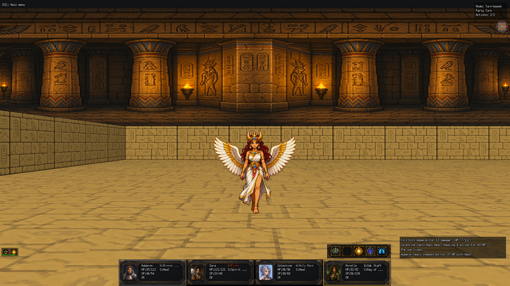
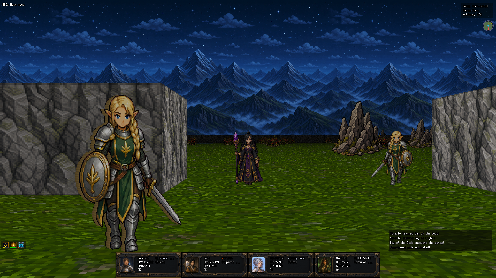
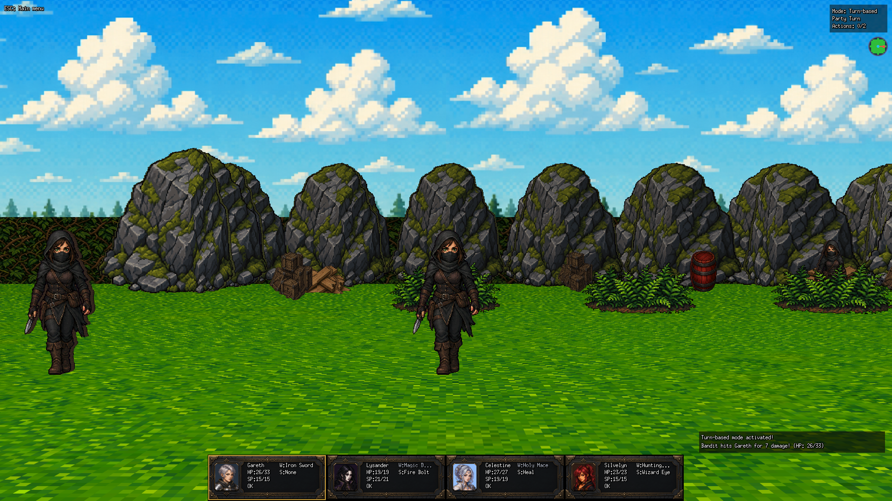
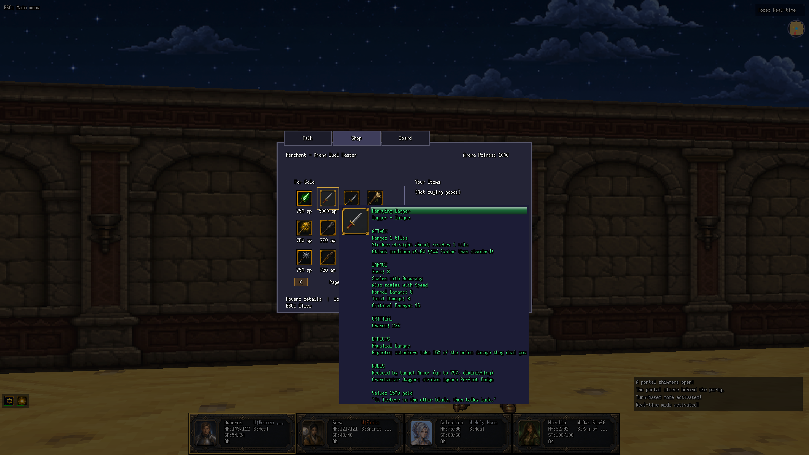
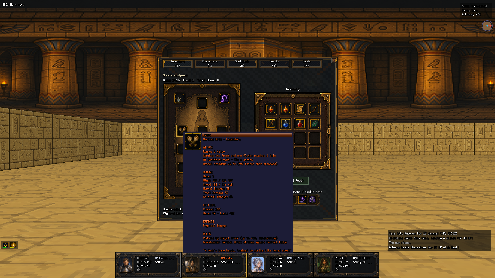
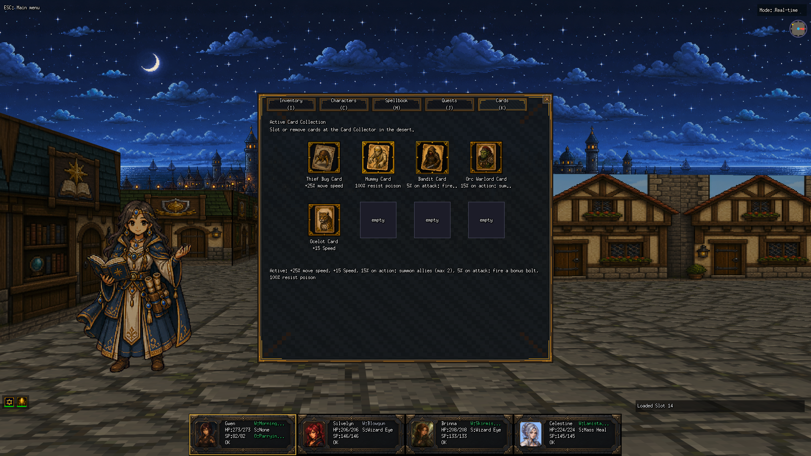

# RaysAndMagic

A retro first-person party RPG built with Go and [Ebiten](https://ebitengine.org/). Lead a four-member party through raycasted dungeons and open wilds, fight in real-time *or* turn-based combat, learn spells from nine schools of magic, and hunt the four dragons that menace the realm.



## Screenshots

| | |
| --- | --- |
|  |  |
| *Day/night cycle - the world darkens, the fights don't stop* | *Bandit ambush in the wilds - roadside props and all* |
|  |  |
| *Arena quartermaster - spend arena points on unique gear* | *Unique classes - a Monk's bare hands outhit steel* |
|  | |
| *Build customization with rare monster cards* | |

## Features

- A four-member party, with classes including Knight, Paladin, Archer, Cleric,
  Sorcerer, Druid, Thief, Arms Master, Monk, Battle Mage, and Sniper.
- Real-time and turn-based combat, weapon mastery, nine schools of magic,
  equipment sets, and collectible monster cards.
- Connected outdoor regions, separate towns and dungeons, day/night encounters,
  wildlife, and tree-climbing jungle lemurs.
- Quests, class promotions, arena duels, merchants, and persistent achievements
  and player statistics.
- A map editor with live content catalogs and monster previews.

## Run and build

Install Go 1.25 or newer; dependencies are pinned in [go.mod](go.mod).
From the repository root:

```sh
go mod download
go run .
```

Run the editor with `go run ./assets/map_viewer`. For the standard local build
(game and editor, including app bundles):

```sh
./build_bin.sh
```

Release archives are built with `./build_mac_release.sh`. Windows-only builds
use `pwsh ./build_debug_console.ps1` or `pwsh ./build_no_console.ps1`.
Optional shader precompilation tools, caches, and rendering diagnostics are
covered in [Rendering and loading](RENDERING.md).

Local `bin/` builds find repository data one directory above the executable.
macOS app bundles use a shared writable data directory at
`~/Library/Application Support/RaysAndMagic/`; bundled YAML and sprites refresh
on updates, while edited maps are preserved. Use the repository build when
editing content. Saves and `player_profile.json` live in the active data
directory's `saves/` folder. Downloaded app bundles are unsigned; macOS may require
approval in System Settings -> Privacy & Security before launch.

## Controls

| Key | Action |
| --- | --- |
| WASD / Arrows | Move and turn |
| Q / E | Strafe |
| R | Weapon attack |
| Space | Smart attack / confirm |
| Left click / hold on a monster | Aim smart attack / repeat while held on that monster |
| F | Cast selected spell |
| C or H | Quick heal |
| 1-4 | Select party member |
| Tab | Toggle real-time / turn-based combat |
| I | Inventory and paperdoll |
| P | Character sheets |
| M | Spellbook |
| J | Quest log |
| T | Interact with nearby NPC |
| Esc | Menu / close dialogs |

Mouse smart attack uses the same healing, spell, and weapon priorities and
cooldowns as Space, without turning the view. Holding repeats after a short
delay. Release, leaving the target, losing it behind a wall, or opening a menu
ends the hold; press again to acquire a target. Friendly party-controlled
creatures and transparent sprite margins are not attack targets. The monster
under the pointer brightens to show which target the click will select.
Background doors and NPCs do not intercept a foreground monster's click.
Explicit mouse aim keeps the selected direction through melee resolution and
projectile flight; the usual weapon arcs, splash and physical interception apply.
Clicks use the last displayed view in both combat modes. An unmatched click
expires in the same input update; turning or moving cannot give it a new target.

Equipped item tooltips mark completed set bonuses in green with `[ACTIVE]`.
Loose items show the set requirements without claiming that the bonus is active.
Overwatch also reacts to enemy attacks against the party, at half its movement
reaction chance. Ballistics adds 2/4/6/8 percentage points of bow/blaster critical
chance from novice through grandmaster; these values share
`internal/character/catalog.go` with other skill effects.
Automatic potion use applies to every class and is configured separately under
`characters.auto_drink` (`threshold_pct`, `interval_seconds`). Field Medicine
increases recovery from both manual and automatic drinking; it does not enable it.

## Add content

Start with [Content authoring](docs/content-authoring.md) for shared conventions,
asset requirements, damage rules, and verification. Most additions use existing
YAML behaviors; a new behavior still needs runtime support.

| Content | Definition files | Guide |
| --- | --- | --- |
| Weapons | `assets/weapons.yaml` | [Weapons](how_to_add_a_new_weapon.md) |
| Spells | `assets/spells.yaml` | [Spells](how_to_add_a_new_spell.md) |
| Monsters and wildlife | `assets/monsters.yaml`, `assets/ecology.yaml` | [Monsters](how_to_add_a_new_monster.md) |
| Items, sets, and drops | `assets/items.yaml`, `assets/loots.yaml` | [Items and loot](docs/adding-items-and-loot.md) |
| NPCs and services | `assets/npcs.yaml` | [NPCs](how_to_add_a_new_npc.md) |
| Quests | `assets/quests.yaml` | [Quests](docs/adding-quests.md) |
| Terrain and props | `assets/tiles.yaml`, `assets/special_tiles.yaml` | [Tiles](how_to_add_a_new_tile.md), [Floor transitions](docs/floor-transitions.md) |
| Maps and connections | `assets/*.map`, `assets/map_configs.yaml`, `assets/open_world.yaml` | [Maps](docs/adding-maps.md) |

Use the [map editor](assets/map_viewer/README.md) to place content and inspect
catalogs. Follow the [dialogue guidelines](docs/content-authoring.md#dialogue) when writing NPC or
quest prose.

## Development

`internal/game` owns gameplay and rendering orchestration; `internal/character`,
`monster`, `items`, `spells`, and `quests` own their respective systems.
`internal/config` owns shared schemas, `internal/world` loads maps and tiles,
and `internal/graphics` loads sprites. Shared contributor conventions are in the
[content guide](docs/content-authoring.md).

```sh
go test ./internal/game -run '^TestContentGuideExamples$' -count=1
go test ./...
go vet ./...
./build_bin.sh
```

Format changed Go files with `gofmt`. After Go or game-code changes,
`./build_bin.sh` is the required final build verification. Content changes also
need an in-game check of appearance, interaction, and save/load behavior; loader
tests cannot prove visual quality. Keep generated previews and intermediate
files in a system temporary directory outside the repository.
