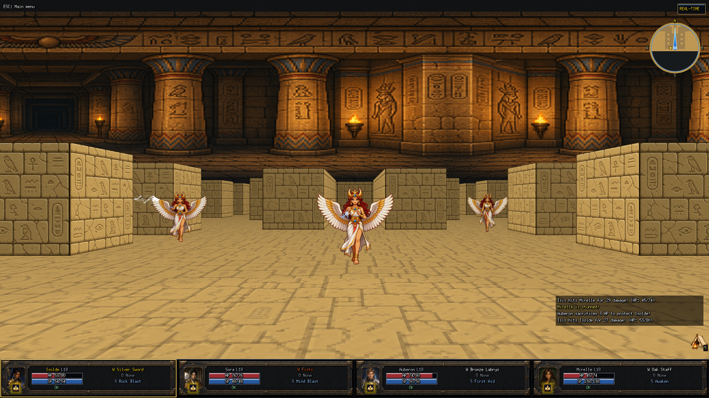
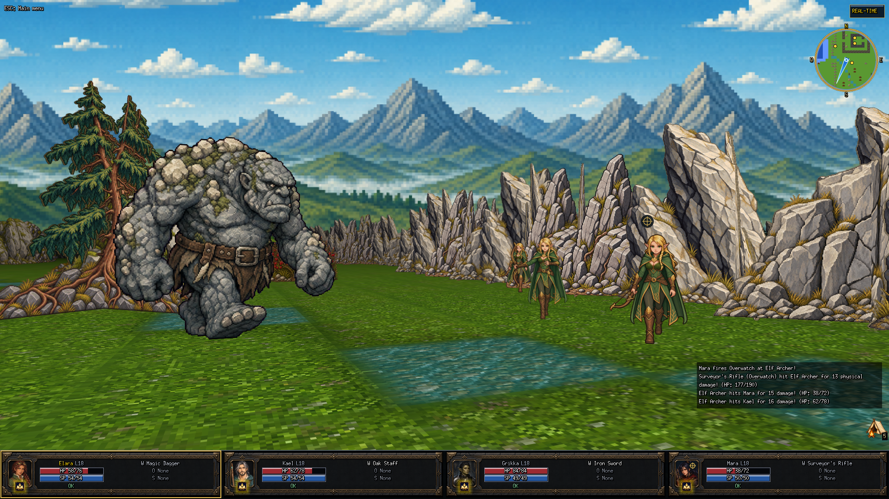
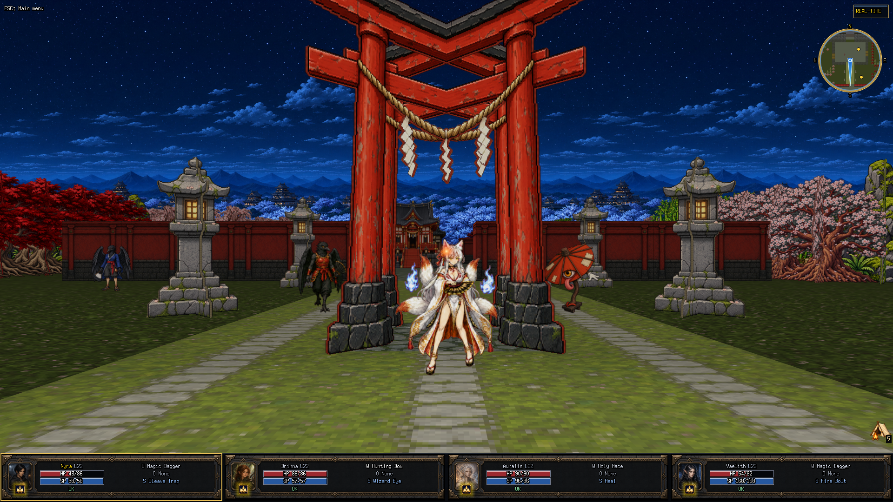
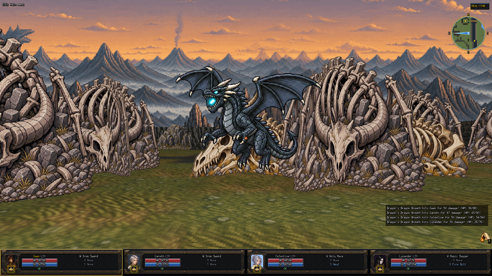
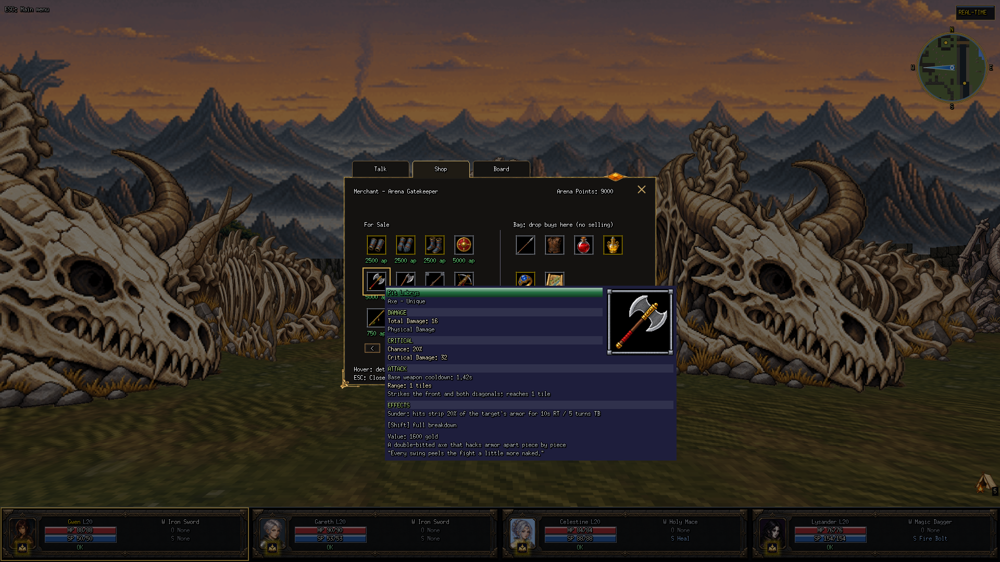
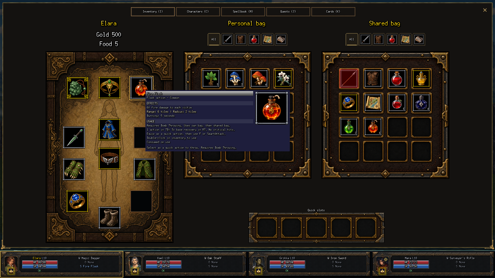
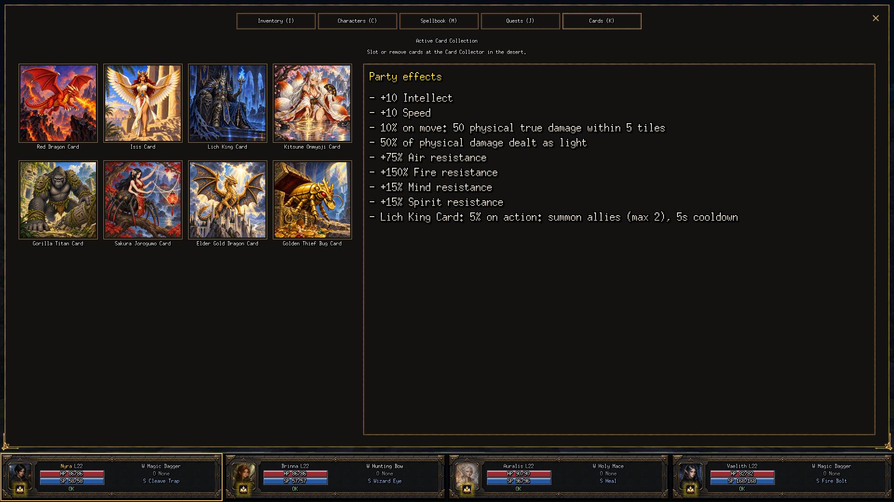

# RaysAndMagic

A retro first-person party RPG built with Go and [Ebiten](https://ebitengine.org/). Lead a four-member party through raycasted dungeons and open wilds, fight in real-time *or* turn-based combat, learn spells from nine schools of magic, and hunt the four dragons that menace the realm.

[Download and play](#download-and-play) | [Controls](#controls) | [Build from source](#build-from-source) | [Add content](#add-content)



## Screenshots

| | |
| --- | --- |
|  |  |
| *Open wilds - a mountain troll charges, elf archers shoot from the rocks* | *Day/night cycle - moonlit yokai guard the Sakura Garden shrine* |
|  |  |
| *Dragon hunt - a drake guards the bone field of the Ember Burn* | *Arena quartermaster - spend arena points on unique gear* |
|  |  |
| *Rare classes - an Alchemist throws the flasks she brews herself* | *Build customization with rare monster cards* |

## Features

- A four-member party, with classes including Knight, Paladin, Archer, Cleric,
  Sorcerer, Druid, Thief, Arms Master, Monk, Battle Mage, and Sniper, plus the
  rare Alchemist and Pilgrim.
- Real-time and turn-based combat, weapon mastery, nine schools of magic,
  equipment sets, and collectible monster cards.
- Connected outdoor regions, separate towns and dungeons, day/night encounters,
  wildlife, and tree-climbing jungle lemurs.
- The jungle ruins of Solstice, with a temple and four elemental chambers,
  traversal challenges, interactive devices, and chamber bosses.
- Gather ingredients, brew potions, and trade supplies with local merchants.
- Quests, class promotions, arena duels, and persistent achievements and player
  statistics.
- A map editor with live content catalogs and monster previews.

## Download and play

Get a packaged build from [GitHub Releases](https://github.com/Akaiko1/RaysAndMagic/releases).
Each archive includes the game and map editor; Go is not needed to play.

| Platform | First launch |
| --- | --- |
| macOS 12+ (Apple Silicon and Intel) | Extract the universal archive and open `RaysAndMagic.app`. Keep the game and editor apps together. |
| Windows 10/11 (64-bit) | Extract the whole archive and run `RaysAndMagic.exe`, keeping `assets/` and `config.yaml` beside it. |

macOS apps are ad-hoc signed, not notarized. If macOS blocks the first launch,
allow the app in System Settings -> Privacy & Security -> Open Anyway. Windows
executables are unsigned; SmartScreen may require More info -> Run anyway.

### Saves and updates

Save files and `player_profile.json` normally live in these locations:

| Launch method | Save directory |
| --- | --- |
| macOS `.app` | `~/Library/Application Support/RaysAndMagic/saves/` |
| Packaged Windows executable | `saves/` beside the executable |
| Local executable in `bin/` | `bin/saves/` |
| `go run .` from the repository root | `saves/` in the repository root |

On Windows, copy the `saves/` folder when moving to a newly extracted release.
macOS apps share their writable content under
`~/Library/Application Support/RaysAndMagic/`. Updates refresh bundled YAML and
sprites. Local map edits survive only while the shipped version of that map is
unchanged; an updated shipped map replaces the edited copy. Use the repository
build for content editing. See [Player profile](docs/player-profile.md) for
achievements and statistics.

## Controls

| Key | Action |
| --- | --- |
| WASD / Arrows | Move and turn |
| Q / E | Strafe |
| Shift + movement | Run in real time |
| R | Weapon attack |
| Space | Interact with a nearby NPC in focus; otherwise smart attack / confirm |
| Left click on a nearby NPC | Open its interaction |
| Left click / hold on a monster | Aim smart attack / repeat while held on that monster |
| F | Cast selected spell |
| C or H | Quick heal |
| 1-4 | Select party member |
| Tab | Toggle real-time / turn-based combat |
| I | Inventory and paperdoll |
| P | Character sheets |
| M | Spellbook |
| J | Quest log |
| K | Card collection |
| V / Shift+V | Pilgrim: Fold Step / Return Step |
| Shift while hovering a tooltip | Show detailed effects and calculations |
| F5 | Quick save |
| Shift+F4 | Quick load |
| Esc | Menu / close dialogs |

Mouse smart attack uses the same priorities and cooldowns as Space without
turning the view. The target under the pointer brightens. Hold to repeat attacks;
release, move off the target, or open a menu to stop. Losing sight of the target
also stops the hold; press again to acquire it.

Drag items into quick slots and double-click a slot to use it. Right-click a
slotted spell or trap to ready it for Space. Skill and item tooltips describe
their current effects; hold Shift for the detailed breakdown.

## Build from source

Install Go 1.25 or newer; [go.mod](go.mod) pins the toolchain and dependencies.
From the repository root:

```sh
go mod download
go run .
```

Run the editor with `go run ./assets/map_viewer`.

| Host platform | Local build |
| --- | --- |
| macOS | `./build_bin.sh` builds the game, editor, app bundles, Windows binaries, and test launchers in `bin/`. |
| Windows | `pwsh ./build_no_console.ps1` builds GUI executables; `pwsh ./build_debug_console.ps1` builds console variants. |
| Linux | `go build -o bin/raysandmagic .` and `go build -o bin/map_viewer ./assets/map_viewer` build native executables. |

Local executables in `bin/` use the repository's `assets/` and `config.yaml`.
Desktop builds do not require Cgo, but Linux still needs graphics/audio runtime
libraries and a display. The Ubuntu dependency list and headless test setup
are maintained in [CI](.github/workflows/ci.yml); use `xvfb-run --auto-servernum`
before graphics-dependent test commands on a headless machine.

On macOS, `./build_mac_release.sh` recreates `dist/` with universal macOS app
bundles and Windows binaries plus content. The [release workflow](.github/workflows/release.yml)
packages these directories into ZIP archives. Optional native shader compilers,
caches, and diagnostics are covered in [Rendering and loading](RENDERING.md).

## Add content

Start with [Content authoring](docs/content-authoring.md) for shared conventions,
asset requirements, damage rules, and verification. Most additions use existing
YAML behaviors; a new behavior still needs runtime support.

| Content | Definition files | Guide |
| --- | --- | --- |
| Weapons | `assets/weapons.yaml` | [Weapons](how_to_add_a_new_weapon.md) |
| Spells | `assets/spells.yaml` | [Spells](how_to_add_a_new_spell.md) |
| Monsters and wildlife | `assets/monsters.yaml`, `assets/ecology.yaml` | [Monsters](how_to_add_a_new_monster.md), [Monster design](docs/monster-design.md) |
| Items, sets, and drops | `assets/items.yaml`, `assets/loots.yaml` | [Items and loot](docs/adding-items-and-loot.md) |
| Alchemy and gathering | `assets/alchemy_recipes.yaml`, `assets/alchemy_spawns.yaml`, `assets/items.yaml` | [Shipped recipes](assets/alchemy_recipes.yaml), [Harvest populations](assets/alchemy_spawns.yaml) |
| Pilgrim techniques | `assets/techniques.yaml` | [Shipped techniques](assets/techniques.yaml) |
| NPCs and services | `assets/npcs.yaml` | [NPCs](how_to_add_a_new_npc.md) |
| Quests | `assets/quests.yaml` | [Quests](docs/adding-quests.md) |
| Terrain and props | `assets/tiles.yaml`, `assets/special_tiles.yaml` | [Tiles](how_to_add_a_new_tile.md), [Floor transitions](docs/floor-transitions.md) |
| Maps and connections | `assets/*.map`, `assets/map_configs.yaml`, `assets/open_world.yaml` | [Maps](docs/adding-maps.md) |
| Icons and frames | `assets/icon_frames.yaml`, `assets/sprites/interface/` | [Asset conventions](docs/content-authoring.md#assets-and-animation) |

Use the [map editor](assets/map_viewer/README.md) to place content and inspect
catalogs. Follow the [dialogue guidelines](docs/content-authoring.md#dialogue) when writing NPC or
quest prose.

## Development

`internal/game` owns gameplay and rendering orchestration; `internal/character`,
`monster`, `items`, `spells`, and `quests` own their respective systems.
`internal/config` owns shared schemas, `internal/world` loads maps and tiles,
and `internal/graphics` loads sprites. Shared contributor conventions are in the
[content guide](docs/content-authoring.md).

Use [developer test scenarios](docs/test-scenarios.md) for disposable playtests.
After a local macOS build, `bin/test_scenario.command solstice` starts the
Solstice fixture with saves isolated from the normal campaign. The same
`--test-scenario solstice` argument works with the game executable on other
platforms.

For code changes, run the relevant tests, then the full checks:

```sh
go test ./...
go vet ./...
./build_bin.sh
```

The final packaging command requires the macOS build host. Linux CI runs
build, vet, and race tests with Xvfb; see the [workflow](.github/workflows/ci.yml).

Format changed Go files with `gofmt`. After Go or game-code changes,
`./build_bin.sh` is the required final build verification. Content changes also
need an in-game check of appearance, interaction, and save/load behavior; loader
tests cannot prove visual quality. Keep generated previews and intermediate
files in a system temporary directory outside the repository.
